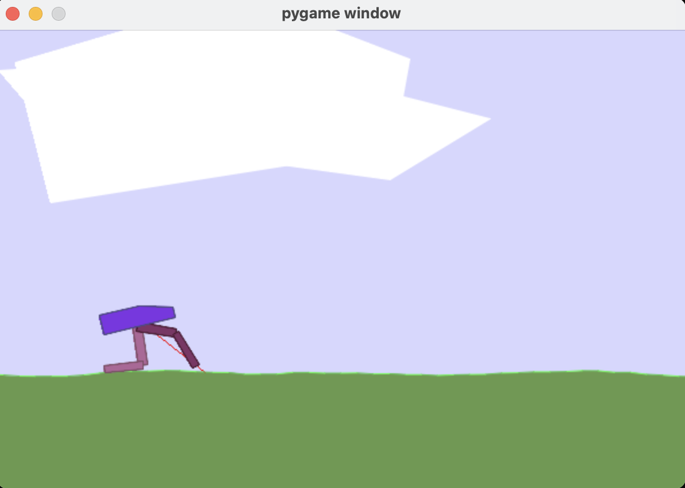
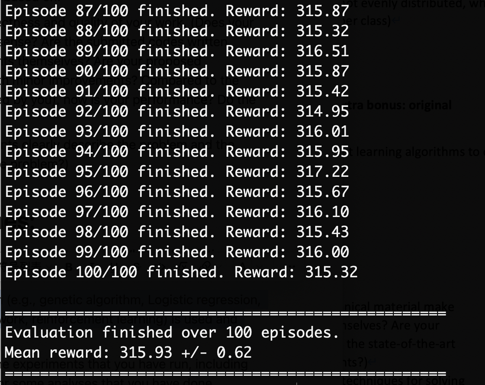
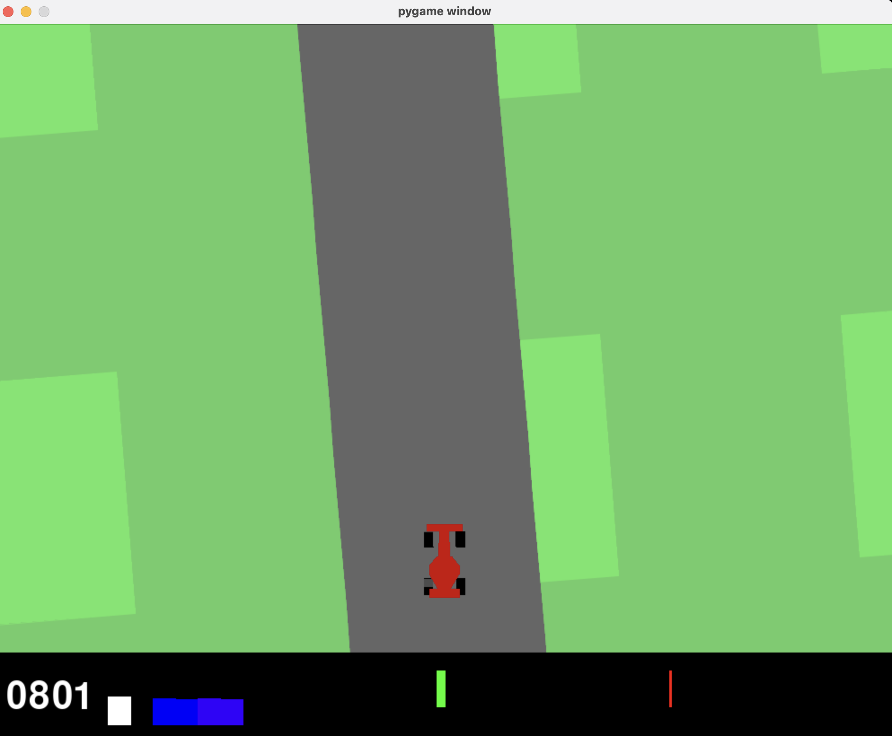
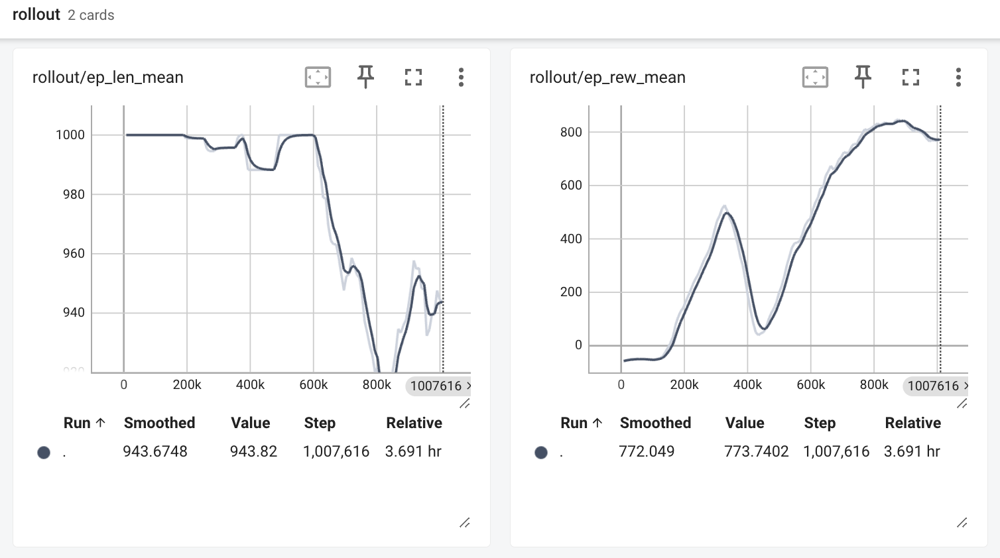
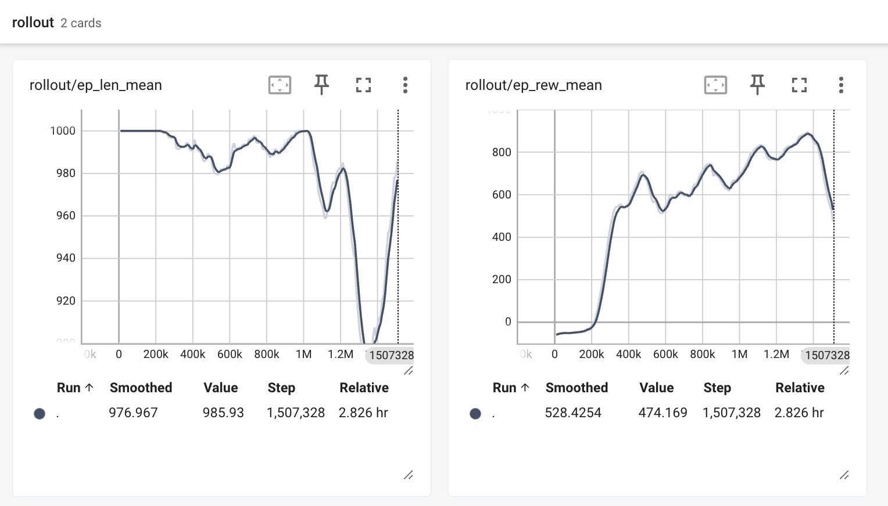
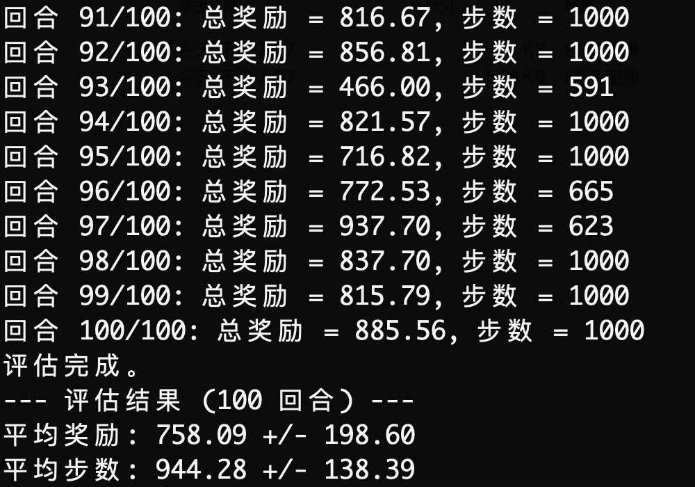
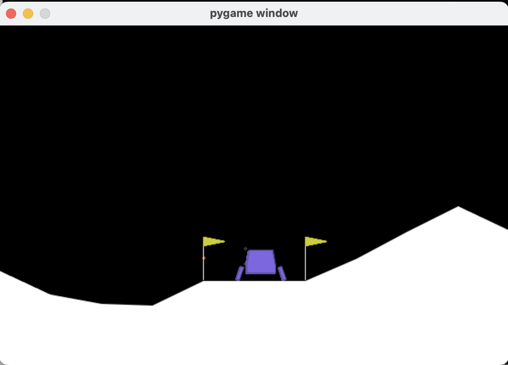
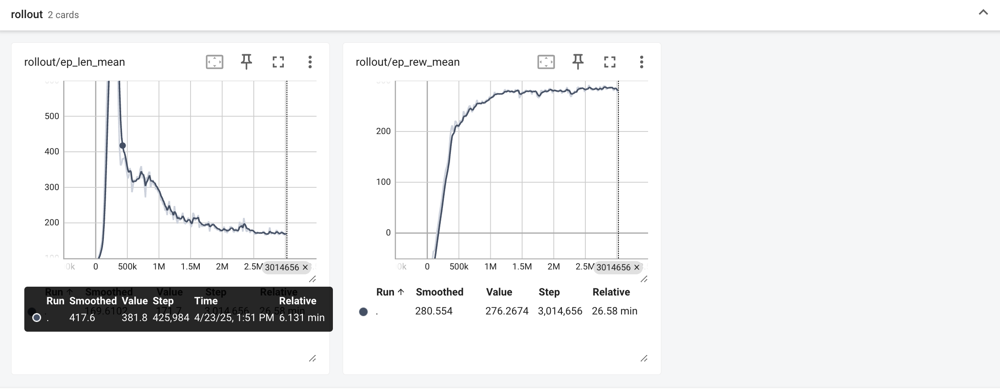
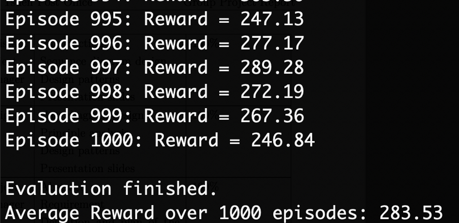

#   Harnessing the Power of Reinforcement Learning: Solving BOX2D Problems with PPO Algorithm

*Chenyu ZHU*  
*City University of Hong Kong*  
*<chenyuzhu9-c@my.cityu.edu.hk>*

## Abstract

This project focuses on applying the advanced reinforcement learning algorithm, Proximal Policy Optimization (PPO), to address diverse continuous and discrete control challenges within the Box2D physics simulation environment. Given PPO's superior performance in stability and effectiveness, and its well-rounded balance for handling complex control tasks, we utilized the Stable Baselines3 library for its implementation and evaluation. Experimental results demonstrate that PPO achieved outstanding performance, surpassing the official "solved" criteria in both BipedalWalker-v3 (bipedal walking) and LunarLander-v3 (lunar landing) tasks, validating its capability to learn effective control strategies. For the pixel-input based CarRacing-v3 (car racing) task, PPO also showed the ability to learn basic driving skills but fell short of the "solved" standard. The analysis revealed instability issues during sharp turns and potential challenges during training, along with discussions on potential improvements. Overall, this project successfully showcases the strong potential and practical value of PPO in solving Box2D benchmark problems and provides practical insights into the algorithm's performance under different task characteristics.

## Problem Background and Method Selection

Reinforcement Learning (RL) is a significant branch of machine learning focused on how an agent learns through trial and error within an environment to maximize its cumulative reward. The agent observes the current state, selects an action, and the environment transitions to a new state, providing a reward signal. This process repeats, allowing the agent to gradually learn an optimal policy—determining the best action to take in a given state for long-term optimal returns. This learning paradigm is naturally suited for complex control tasks requiring sequential decision-making.

This project targets control problems within the Box2D physics simulation environment. Box2D is a popular 2D physics engine offering a range of challenging benchmark tasks such as BipedalWalker (bipedal walking) and LunarLander (lunar landing). These tasks share common characteristics:
1.  **Complex Physics Dynamics**: The environment adheres to relatively realistic physical laws, requiring the agent to learn fine-grained control.
2.  **High-Dimensional Continuous State Space**: The agent's state is typically described by multiple continuous variables (e.g., joint angles, velocities).
3.  **Continuous Action Space**: Control signals are often continuous forces or torques (though some tasks like LunarLander use discrete actions derived from continuous thrust).

These features make traditional supervised learning methods difficult to apply directly, as "correct action" labels are usually unavailable. RL, however, allows the agent to explore and learn control strategies through direct interaction with the environment.

Among the numerous RL algorithms, we needed to select one best suited for solving continuous control tasks like those in Box2D. RL algorithms can be broadly categorized into:
*   **Value-based Methods**: Such as Q-Learning and DQN, primarily learn the value of states or state-action pairs. They have achieved great success in discrete action space problems but are challenging to apply directly to high-dimensional continuous action spaces without modifications (e.g., the Critic part in DDPG).
*   **Policy Gradient Methods**: Such as REINFORCE, directly learn the policy function. These methods naturally handle continuous action spaces but often suffer from high variance in gradient estimation, slow convergence, and low sample efficiency.
*   **Actor-Critic Methods**: Combine value-based and policy gradient approaches, typically including an Actor that learns the policy and a Critic that learns a value function to evaluate the policy. These methods are currently mainstream for solving continuous control problems.

Considering the continuous nature and complexity of Box2D tasks, the Actor-Critic framework is a natural choice. Within this framework, various specific algorithms exist, such as A2C/A3C, DDPG, TRPO, PPO, etc. We ultimately chose the **Proximal Policy Optimization (PPO)** algorithm for the following main reasons:

1.  **Optimization for Continuous Control**: Unlike DQN, which is primarily designed for discrete actions, PPO (like many Actor-Critic methods) can directly and naturally handle the continuous action spaces common in Box2D environments.
2.  **Stability and Performance**:
    *   Compared to basic policy gradient methods (e.g., REINFORCE), PPO significantly improves training stability and convergence by limiting the magnitude of policy updates (using a Clipped Surrogate Objective or KL divergence constraint), reducing the risk of policy collapse. The high variance issue of basic policy gradient methods makes training very unstable.
    *   Compared to Trust Region Policy Optimization (TRPO), which is similarly robust but complex to implement, PPO uses first-order optimization, is simpler to implement, has lower computational overhead, yet achieves similar or even better performance on many tasks. TRPO requires computing and storing the inverse of the Fisher Information Matrix, which is computationally expensive.
    *   Compared to some popular off-policy Actor-Critic algorithms (e.g., DDPG), PPO is generally considered less sensitive to hyperparameter choices and offers more stable training, especially in complex dynamic environments. DDPG can sometimes become unstable due to its deterministic policy and reliance on Q-function estimation.
3.  **Sample Efficiency and Tuning**:
    *   Although PPO is an on-policy algorithm (theoretically less sample efficient than off-policy methods), it improves sample utilization by performing multiple optimization iterations (multiple epochs) on the same batch of data collected in each phase, significantly outperforming basic on-policy methods (like A2C or REINFORCE, which typically use each sample only once).
    *   Compared to TRPO and DDPG, PPO generally has fewer or more robust hyperparameters to tune, making the tuning process relatively easier.
4.  **Implementation Simplicity**: PPO's core idea is relatively intuitive, and the implementation complexity of its clipped objective version is much lower than TRPO, facilitating rapid deployment, experimentation, and debugging.

In summary, the PPO algorithm strikes a good balance between stability, performance, sample efficiency, and implementation complexity, making it a powerful tool for solving challenging continuous control problems like those in Box2D. Therefore, we selected PPO as the core algorithm for this project.

## Experiments

### Experimental Setup

We conducted experiments in standard reinforcement learning environments provided by Box2D, such as BipedalWalker-v3 and LunarLander-v3. These environments offer recognized benchmarks for evaluating the learning capabilities of agents in continuous control tasks.

Regarding algorithm implementation, we initially attempted to build the PPO algorithm from scratch. While this was very helpful for gaining a deep understanding of PPO's internal mechanisms, we encountered several challenges in practice:

1.  **Training Instability**: The self-implemented version exhibited significant volatility during training, sometimes making it difficult to reproduce ideal results or even causing sudden performance degradation.
2.  **Debugging Difficulty**: Debugging RL algorithms is inherently complex. Subtle implementation errors (e.g., in gradient calculation, advantage estimation, or network architecture) could lead to training failure, and locating and fixing these issues was very time-consuming.
3.  **Convergence Speed**: Compared to results reported in the literature, our self-implemented version lagged in convergence speed and final performance, possibly due to suboptimal hyperparameter choices, code optimization, or implementation details.

Facing these challenges, and to ensure the reliability and reproducibility of our research, we decided to switch to using a widely validated and community-supported reinforcement learning library. After research and comparison, we chose **Stable Baselines3 (SB3)**. The main reasons for selecting SB3 were:

*   **Code Quality and Reliability**: SB3 provides rigorously tested and optimized implementations of PPO and other mainstream RL algorithms. Its high code quality, stable operation, and reliable results are widely used in academic research and industry.
*   **Ease of Use and Efficiency**: SB3 encapsulates complex implementation details, offering a concise and unified API. This allowed us to focus more on environment design, hyperparameter tuning, and experimental analysis, rather than getting bogged down in debugging low-level code.
*   **Reproducibility**: Using a standard library like SB3 helps ensure that our experimental results are more easily reproducible by others, a crucial principle in scientific research.
*   **Community and Documentation**: SB3 has an active community and comprehensive documentation, making it easy to find information and solve problems.

Therefore, although we went through the phase of self-implementation, the final adoption of the PPO implementation from Stable Baselines3 was based on a comprehensive consideration of research efficiency, result reliability, and reproducibility. This enabled us to stand on a solid foundation and concentrate on the application and analysis of the algorithm on Box2D problems.

### Experimental Procedure

Our experiments followed a standardized procedure to train and evaluate the performance of PPO agents on different Box2D tasks. For each selected task (e.g., BipedalWalker-v3, LunarLander-v3):

1.  **Training Phase**: We utilized PPO training scripts based on the Stable Baselines3 library to train the agent. During this phase, the agent continuously interacted with the environment, updating its policy and value networks via the PPO algorithm, aiming to maximize cumulative reward. We recorded key metrics during training, such as average episode reward and loss function values, to monitor learning progress.

2.  **Evaluation Phase**: Once training reached a predetermined number of steps or met a certain convergence criterion, we saved the trained agent model. Subsequently, we used a separate evaluation script to test the model's performance. This script ran the trained agent in the environment for multiple episodes without policy updates, recording its average reward, success rate, or other task-specific metrics over these episodes. This provided an objective measure of the agent's final learned effectiveness.

3.  **Result Analysis**: Finally, we collected and analyzed the training process data and evaluation results. This included plotting learning curves (e.g., reward change over training steps), comparing performance differences under various hyperparameter settings, and conducting qualitative observations of the agent's learned behavior (e.g., watching recordings of the agent's runs).

This phased approach ensured the independence of training and evaluation, allowing us to clearly understand the learning capability and final performance of the PPO algorithm on each Box2D task. Specific training details, hyperparameter settings, and detailed results for each task will be presented separately in the following sections.

### Task 1: BipedalWalker-v3 (Bipedal Walking Robot)

#### Task Description
BipedalWalker-v3 is a challenging and popular benchmark task in the Box2D environment. The goal is to control a 2D robot, shown below, with two legs (each leg having two joints: hip and knee), to walk forward on randomly generated rugged terrain.

The terrain includes obstacles like pits, stumps, and steps. The agent needs to learn coordinated control of the torques applied to its four joints (left/right hip, left/right knee) to maintain balance, overcome obstacles, and move forward as quickly as possible. The state space consists of 24 continuous variables, including lidar information (detecting terrain ahead), its own posture (hull angle, angular velocity), joint states (angle, angular velocity), and whether the legs are in contact with the ground. The action space consists of 4 continuous values, corresponding to the torques applied to the four joints.

The reward mechanism encourages forward progress: a positive reward is given for each small distance moved forward. It also penalizes inefficient or dangerous behavior: applying excessive torque incurs a small penalty, and if the robot falls (head touches the ground), it receives a heavy penalty of -100 and the episode ends.

#### Training and Results
We used the PPO algorithm implemented in the Stable Baselines3 library to train the BipedalWalker-v3 agent. The training process followed the steps described in the "Experimental Procedure". According to the training script `train_bipedal_walker_ppo.py`, key parameters included: `n_steps=2048` (steps collected before each update), `batch_size=64` (mini-batch size), and training was conducted for a total of 3,000,000 steps on the `cpu` device.

After training, we loaded the best-performing model and conducted a rigorous evaluation. The evaluation involved running the agent independently in the environment for 100 complete episodes and recording the final reward for each episode. The terminal output summary of the evaluation results is shown below:

The evaluation results show that the agent performed stably over 100 consecutive episodes, achieving an **average cumulative reward of 315.93** with a standard deviation of 0.62. This indicates that the agent not only learned to walk but could also consistently achieve high scores.

#### Analysis
According to the definition on the OpenAI Gym official leaderboard ([https://github.com/openai/gym/wiki/Leaderboard](https://github.com/openai/gym/wiki/Leaderboard)) for BipedalWalker-v3, the task is considered "solved" when an algorithm achieves an average reward of 300 over 100 consecutive trials.

The average reward of 315.93 obtained by our PPO agent clearly exceeds the solving threshold of 300 points. This strongly demonstrates the effectiveness of the PPO algorithm on this task and that our trained model has mastered the key strategies for stable and efficient walking on complex terrain. The agent can coordinate its leg movements well, adapt to different terrain changes, avoid falling, and maximize its forward distance.

### Task 2: CarRacing-v3 (Car Racing)

#### Task Description
CarRacing-v3 is a classic reinforcement learning task involving continuous control from pixel inputs. The agent's goal is to control a race car to drive as fast as possible on a randomly generated track and achieve a high score. The environment provides a top-down view RGB image as the state observation, as shown below.

The agent needs to decide on three continuous actions based on the visual information from the screen: steering (-1 to +1), acceleration (0 to +1), and braking (0 to +1). The state space is a (96, 96, 3) pixel image. Since the input is image-based, we need to use a Convolutional Neural Network (CNN) to process the visual information, hence we chose the `CnnPolicy` in Stable Baselines3.

The reward mechanism is relatively simple: visiting a new track tile yields a reward of +1000/N, where N is the total number of tiles on the track. Applying the throttle incurs a penalty of -0.1 per step. If the car goes off-track, it receives a -100 penalty, and the episode ends. An episode lasts at most 1000 steps.

#### Training Process and Model Selection
We trained the agent for this task using the PPO algorithm and `CnnPolicy`. Key hyperparameter settings (based on `train_car_rancing_ppo.py`) included: `n_steps=2048`, `batch_size=64`, `n_epochs=4`, `gamma=0.99`, `gae_lambda=0.95`, `clip_range=0.2`, `ent_coef=0.01`, `vf_coef=0.5`, along with a learning rate scheduler.

We conducted multiple training attempts, exploring the impact of different training steps on model performance, primarily focusing on 300k, 1 million, and 1.5 million steps.

*   **1 Million Steps Training**: The figure below shows the TensorBoard monitoring curves (average episode reward `ep_rew_mean` and average episode length `ep_len_mean`) around 1 million training steps.

    

    The graph shows that the average reward increased steadily during training, plateauing around 600k steps, fluctuating between 700-800 points. The average episode length also remained mostly above 940 steps, indicating that the agent could complete long episodes in most cases without going off-track too early. This suggests the model learned a relatively effective driving strategy by 1 million steps.

*   **1.5 Million Steps Training**: We attempted to extend the training to 1.5 million steps, hoping for better performance. However, the TensorBoard curves revealed an unexpected situation:

    

    Although the average reward reached a higher peak (close to 900 points) around 1.2 million steps, a sharp performance decline followed, with both average reward and episode length dropping significantly. This could be an instance of "catastrophic forgetting," where the model overwrites previously learned good strategies during subsequent learning.

Based on these observations, although the 1.5 million step training reached a higher peak at one stage, its final state was unstable and performed poorly. Therefore, we chose **the model saved at the end of 1 million training steps** for the final evaluation, as it represented a more stable and reliable level of performance.

#### Evaluation and Results
We loaded the model obtained after 1 million training steps and conducted an evaluation over 100 episodes. The evaluation result statistics are as follows:

The evaluation shows that the model achieved an **average reward of 758.09** over 100 episodes, with a standard deviation of 198.60. The average episode steps were 944.28 ± 138.39.

#### Analysis and Discussion
According to the OpenAI Gym official leaderboard definition ([https://github.com/openai/gym/wiki/Leaderboard](https://github.com/openai/gym/wiki/Leaderboard)), the "solved" criterion for the CarRacing-v3 task is an average reward of 900 over 100 consecutive trials. Our model's score of 758.09, while a decent result indicating the agent learned basic driving skills (staying on track), is still significantly below the threshold for "solving" the task.

Noteworthy is the **extremely high standard deviation (198.60)** in the evaluation results. This aligns with our observations during the evaluation process: the agent performed excellently in some episodes, achieving scores above 900, but performed poorly in others. The primary failure mode occurred during sections requiring **sharp turns**. In these situations, the agent seemed unable to precisely control speed and steering, often losing control due to oversteering or excessive speed, causing the car to spin in place or go off-track, thus receiving very low scores. This instability is the main reason the average score did not reach 900 and the standard deviation is large.

**Potential Improvement Directions**:
1.  **Hyperparameter Optimization**: CarRacing might be more sensitive to hyperparameters, especially those related to exploration (like entropy coefficient `ent_coef`) and learning rate. More detailed tuning is needed.
2.  **State Representation**: Currently using only single frames. Employing **Frame Stacking**, which stacks several consecutive frames as input, could provide the agent with motion information (velocity, angular velocity), potentially helping to better handle dynamic turns.
3.  **Network Architecture**: The default convolutional layer structure in `CnnPolicy` might not be optimal. Trying deeper or different CNN architectures could be beneficial.
4.  **Reward Shaping**: Designing a more complex reward function, perhaps incorporating rewards or penalties for speed, steering smoothness, or staying in the center of the track, could guide the agent to learn finer driving behaviors and avoid spinning out.
5.  **Training Strategy**: Given the catastrophic forgetting observed in the 1.5M step training, one could try adjusting the learning rate decay strategy, using a smaller learning rate for longer, more stable training, or incorporating techniques to prevent forgetting.

In conclusion, while we achieved preliminary success using PPO on CarRacing-v3, reaching the "solved" standard and overcoming the issue of losing control in sharp turns requires further exploration and improvement in areas such as state representation, reward design, network structure, and hyperparameter tuning.

### Task 3: LunarLander-v3 (Lunar Lander)

#### Task Description
LunarLander-v3 is another classic control problem in the Box2D environment. The goal is to control a small lander to land safely and smoothly between two flags on a designated landing pad under simulated lunar gravity, as shown below.

The agent needs to control three thrusters: the main engine (downward thrust) and two side engines (directional control). The action space is discrete, with four options: do nothing, fire left engine, fire main engine, fire right engine. The state space is described by 8 continuous variables: lander's coordinates (x, y), linear velocities (vx, vy), angle, angular velocity, and whether each of the two legs is in contact with the ground.

The reward mechanism is designed to encourage smooth landings:
*   Moving closer to the landing pad yields rewards.
*   The episode ends if the lander crashes or comes to a complete rest.
*   Crashing incurs a -100 reward; successful landing yields +100 reward.
*   Each leg touching the ground gives +10 reward.
*   Firing the main engine has a small fuel consumption penalty (-0.3 per frame).
*   Firing side engines has an even smaller fuel penalty (-0.03 per frame).

#### Training Process
We again used the PPO algorithm from Stable Baselines3, paired with `MlpPolicy` (since the state is a vector, not an image), to train the LunarLander agent. According to the training script `train_lunar_lander_ppo.py`, key hyperparameters included: `n_steps=2048`, `batch_size=64`, `n_epochs=10`, `gamma=0.99`, `gae_lambda=0.95`, `clip_range=0.2`, `learning_rate=0.0003`. Notably, `ent_coef=0.0`, meaning entropy regularization was not used to encourage exploration in this training run. The total number of training steps was set to 3,000,000.

The figure below shows the TensorBoard monitoring curves during the training process:

**Training Curve Analysis**:
From the average reward curve on the right (`rollout/ep_rew_mean`), we can see the agent's performance rapidly improved within the first ~500k steps, quickly surpassing an average reward of 200. Subsequently, the reward continued to increase slowly and stabilized at a high level above 250 points until the end of the 3 million training steps, without showing performance collapse like in CarRacing. The average episode length curve on the left (`rollout/ep_len_mean`) shows that in the early stages of learning, the agent required more steps (possibly due to inefficiency or crashes), but as learning progressed, it was able to complete the landing task more quickly, with the average steps stabilizing around 200. This indicates that the PPO algorithm performed stably on this task, the learning process was efficient without catastrophic forgetting, and the model reached a good and stable state at the end of training.

#### Evaluation and Results
After training, we loaded the final model and conducted a large-scale evaluation over 1000 episodes to thoroughly test its performance and robustness. The terminal output of the evaluation results is as follows:

The evaluation results show that the agent achieved an **average reward of 283.53** over 1000 episodes.

#### Analysis
According to the OpenAI Gym official leaderboard ([https://github.com/openai/gym/wiki/Leaderboard](https://github.com/openai/gym/wiki/Leaderboard)), the "solved" criterion for the LunarLander-v3 task is an average reward of 200 over 100 consecutive trials. We not only conducted evaluations far exceeding 100 trials (1000 trials), but the obtained average reward of 283.53 is **significantly higher** than the 200-point threshold.

This fully demonstrates that the PPO algorithm can solve the LunarLander-v3 problem exceptionally well. The training process was stable, and the final model not only performed excellently but also exhibited high robustness across numerous tests, consistently completing safe and precise landing maneuvers. It can be said that our PPO implementation beautifully conquered this benchmark task.

## Conclusion

This project aimed to explore and apply reinforcement learning techniques, specifically the Proximal Policy Optimization (PPO) algorithm, to solve a series of challenging control tasks within the popular Box2D physics simulation environment. We chose the PPO algorithm primarily because it strikes a good balance between stability, performance, sample efficiency, and implementation complexity, making it a powerful tool for handling both continuous and discrete action space control problems.

By leveraging the reliable PPO implementation provided by the Stable Baselines3 library (after an initial attempt at self-implementation), we successfully trained and evaluated agents in multiple Box2D environments:

*   In the **BipedalWalker-v3** task, our trained agent achieved an average reward significantly exceeding the official "solved" standard (315.93 vs 300), proving PPO's capability to learn strategies for stable and efficient walking on complex terrain.
*   In the **LunarLander-v3** task, our model performed equally impressively, obtaining an average reward far exceeding the "solved" standard (200 points) during a large-scale 1000-episode evaluation (283.53), showcasing PPO's efficiency and robustness on this task.
*   In the **CarRacing-v3** task, although the agent learned basic driving skills and achieved a respectable average reward (758.09), it did not meet the "solved" standard (900 points). We observed instability in the model's handling of sharp turns, leading to high performance variance. Furthermore, we documented and analyzed potential catastrophic forgetting during training, which informed our choice of a more stable model for evaluation. The analysis of this task also highlighted potential future improvement directions, such as enhancing state representation using frame stacking, optimizing hyperparameters, or employing reward shaping.

Overall, this project successfully validated the effectiveness of the PPO algorithm as a solution for various control tasks within the Box2D environment. Our experiments not only demonstrated the algorithm's performance across different tasks but also highlighted potential issues and corresponding analyses when facing specific challenges (like pixel-based inputs and high dynamic complexity). These findings provide practical evidence for understanding the advantages and limitations of the PPO algorithm and lay a foundation for future applications in more complex reinforcement learning problems.

## References

1.  Brockman, G., Cheung, V., Pettersson, L., Schneider, J., Schulman, J., Tang, J., & Zaremba, W. (2016). OpenAI Gym. *arXiv preprint arXiv:1606.01540*.
    [https://github.com/openai/gym](https://github.com/openai/gym)

2.  Raffin, A., Hill, A., Gleave, A., Kanervisto, A., Ernestus, M., & Dormann, N. (2021). Stable-Baselines3: Reliable Reinforcement Learning Implementations. *Journal of Machine Learning Research, 22(268), 1-8*.
    [https://github.com/DLR-RM/stable-baselines3](https://github.com/DLR-RM/stable-baselines3)

3.  OpenAI Gym Leaderboard (Community Wiki). (Accessed [Current Date, e.g., 2024-07-27]).
    [https://github.com/openai/gym/wiki/Leaderboard](https://github.com/openai/gym/wiki/Leaderboard)
